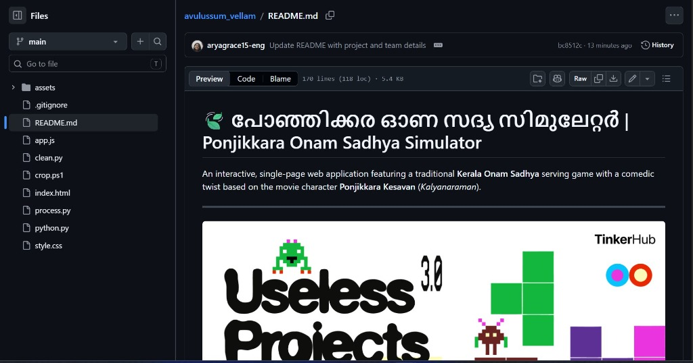
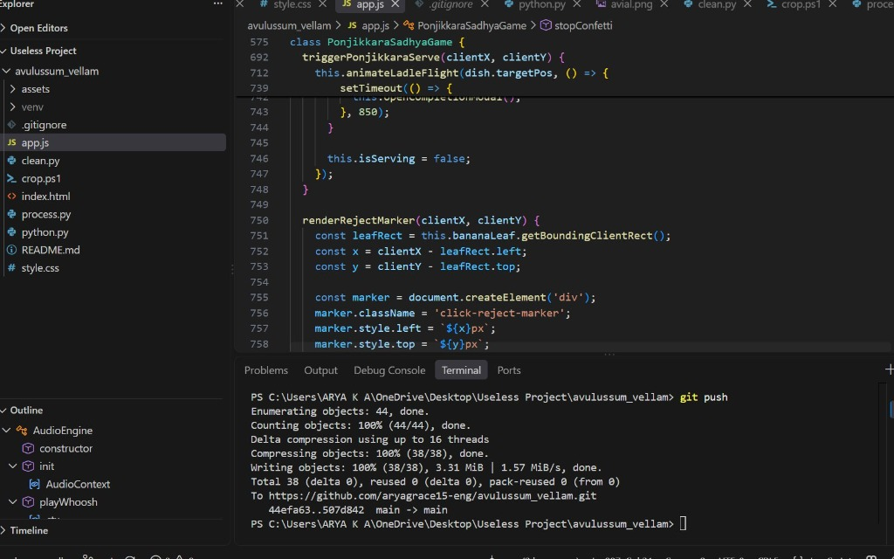
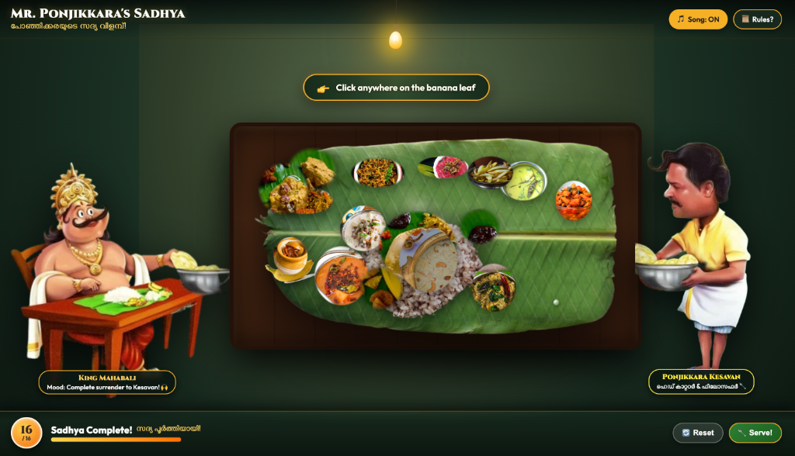
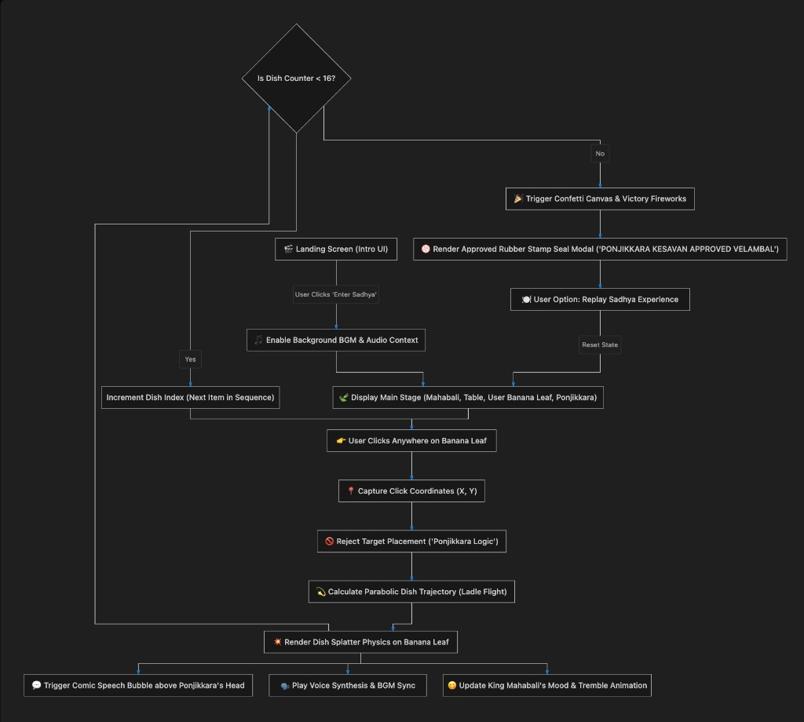

# 🍃 Ponjikkara Onam Sadhya Simulator 🎯

## Basic Details
- **Team Name**: Avulussum Vellam
- **Team Members**:
  - **Team Lead**: Arya Grace - College
  - **Member 2**: Akshita Sivasankaran - College
  - **Member 3**: Team Member - College

## Project Description
An interactive, comedic single-page web application featuring a traditional Kerala Onam Sadhya serving experience. Players try to click where dishes should go on King Mahabali's banana leaf, but head caterer **Ponjikkara Kesavan** (*Kalyanaraman*) rejects every instruction and launches dishes wherever he wants!

## The Problem (that doesn't exist)
People attending Onam Sadhyas are forced to follow strict dining etiquette on where Parippu, Sambar, Avial, and Payasam are placed on the banana leaf, depriving society of chaotic catering freedom.

## The Solution (that nobody asked for)
Introducing Ponjikkara's Sadhya Simulator—an interactive simulator where head caterer Ponjikkara Kesavan ignores your placement clicks, scoffs at traditional rules, speaks out loud via Web Speech Synthesis, and splatters 16 authentic dishes with dynamic physics onto the leaf!

---

## Technical Details

### Technologies/Components Used

#### For Software:
- **Languages used**: HTML5, JavaScript (ES6+), CSS3
- **Frameworks used**: Vanilla Web Stack (No external frontend frameworks required)
- **Libraries used**:
  - Web Audio API (Background Music & Audio FX)
  - Web Speech API (`SpeechSynthesis` for Malayalam Voice Lines)
  - HTML5 Canvas 2D API (Dish Trajectories, Splatters, Steam, Confetti)
  - Google Fonts (`Cinzel`, `Noto Serif Malayalam`, `Gayathri`, `Outfit`, `Montserrat`)
- **Tools used**: Python 3 (`http.server`), Git & GitHub, Pillow (PIL Image Processing)

#### For Hardware:
- *N/A (Software Project)*

---

## Implementation

### For Software:

#### Installation
```bash
# Clone the repository from GitHub
git clone https://github.com/aryagrace15-eng/avulussum_vellam.git

# Navigate into the project directory
cd avulussum_vellam
```

#### Run
```bash
# Start the local Python HTTP web server
python3 -m http.server 8099

# Open http://localhost:8099 in your web browser
```

---

## Project Documentation

### For Software:

#### Screenshots

  
*TinkerHub Useless Projects 3.0 event submission and GitHub repository overview.*

  
*Developer workspace showing VS Code editor, game state controller logic, and terminal git execution.*

  
*Interactive game arena featuring King Mahabali, Ponjikkara Kesavan, the realistic banana leaf plate, and 16 served Sadhya delicacies.*

#### Diagrams

  
*Game State Workflow Diagram showing Landing Screen, Audio Engine Initialization, Click Coordinates Capture, Ponjikkara Rule Override, Trajectory Calculation, Splatter Physics, Speech Synthesis, and Approved Rubber Stamp Seal Modal.*

---

## Project Demo

### Video
[Demo Video Link](#)  
*Demonstrates interactive dish placement, Ponjikkara logic overrides, background song playback, speech synthesis, and the rubber stamp seal completion modal.*

### Additional Demos
- Live Local Server: `http://localhost:8099`

---

## Team Contributions
- **Arya Grace**: Project Conceptualization, Character Asset Selection, UI/UX Layout Design & Git Repository Management.
- **Akshita Sivasankaran**: Core Game Engine Implementation, Physics Trajectory Animations, Audio/Speech API Integration, Image Processing Cutouts & CSS Styling.
- **Team Member**: Testing, Sadhya Dish Etiquette Research & Documentation.

---

Made with ❤️ at **TinkerHub Useless Projects 3.0**


